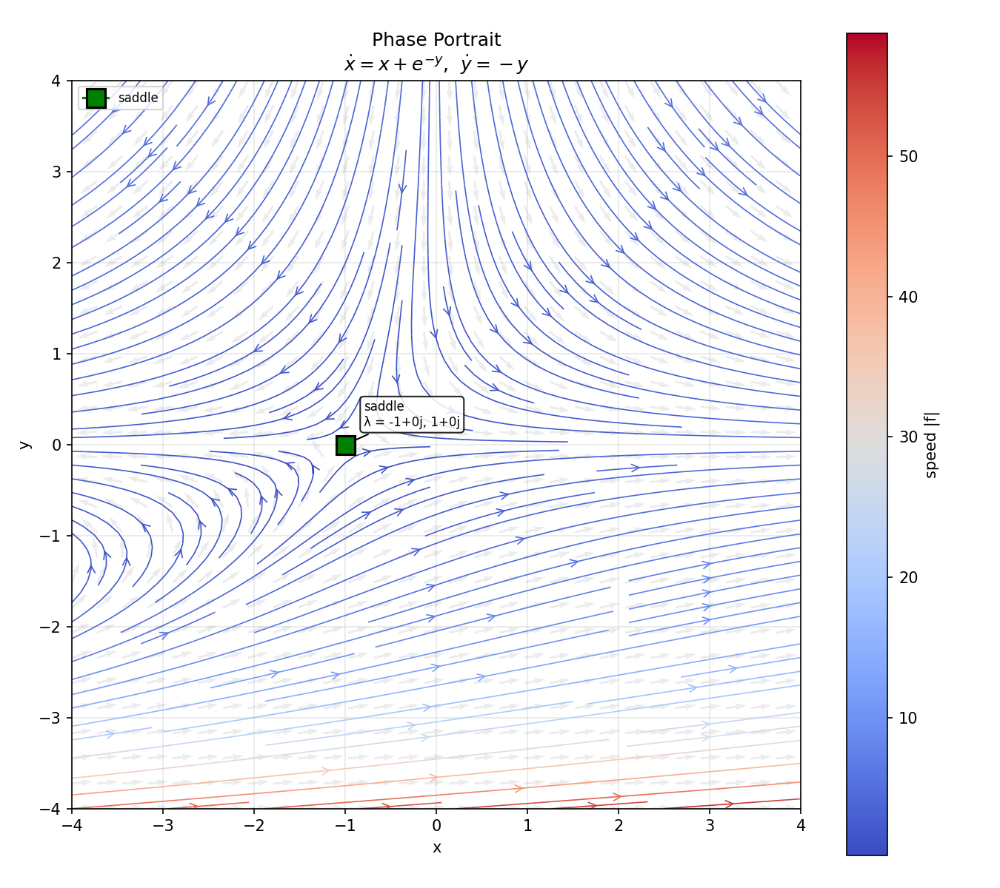
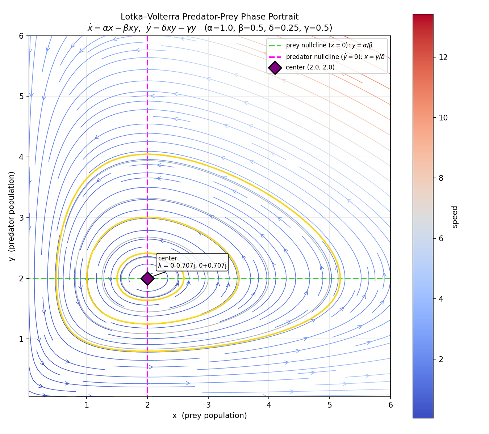
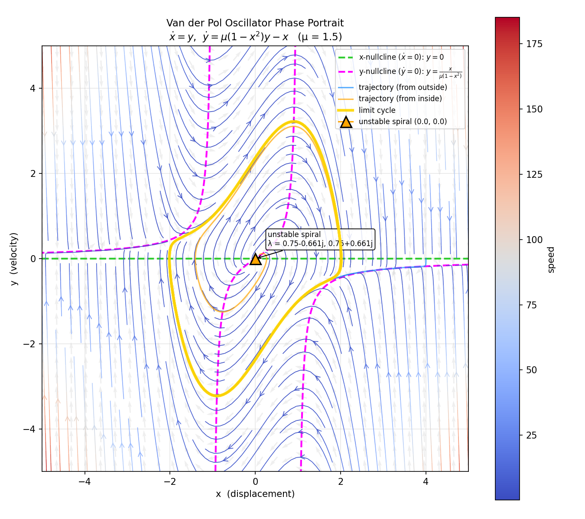
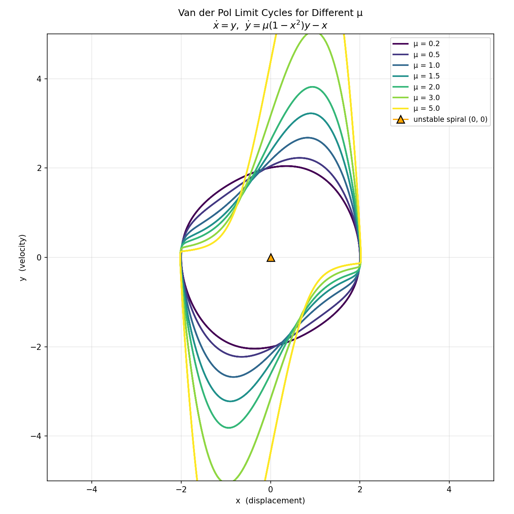
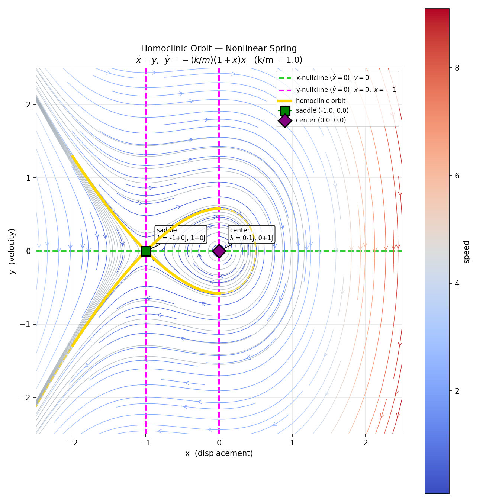
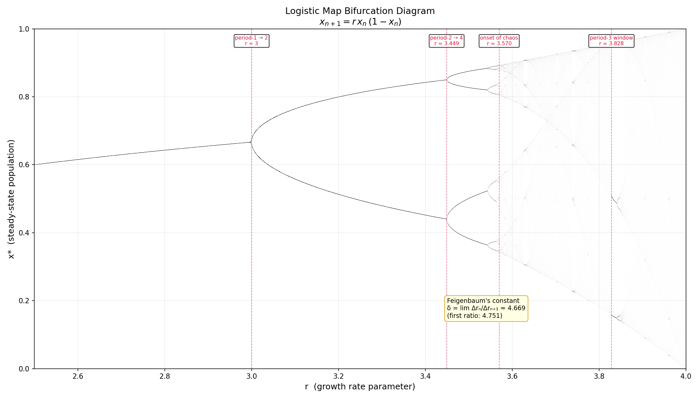
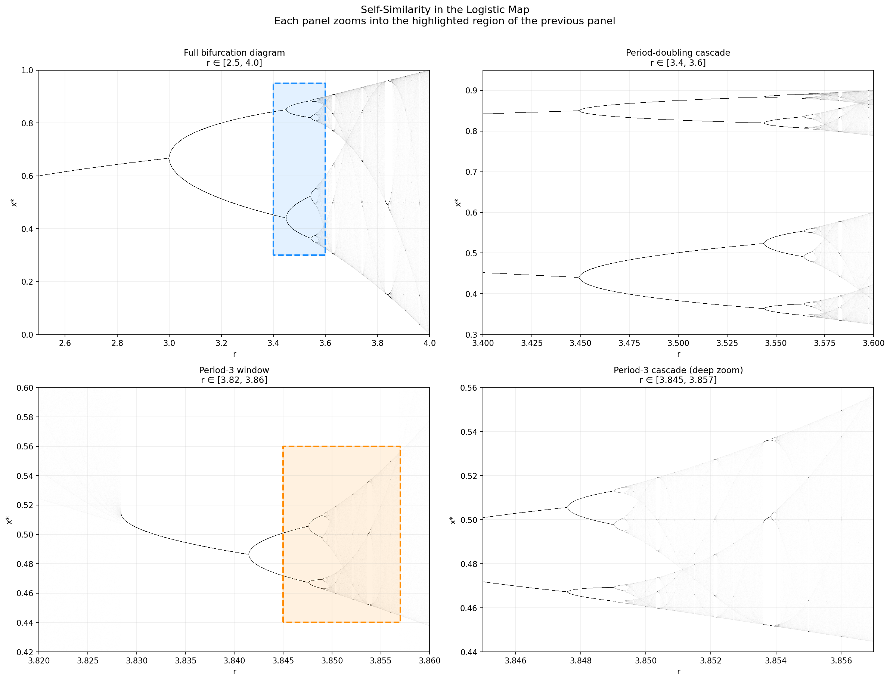
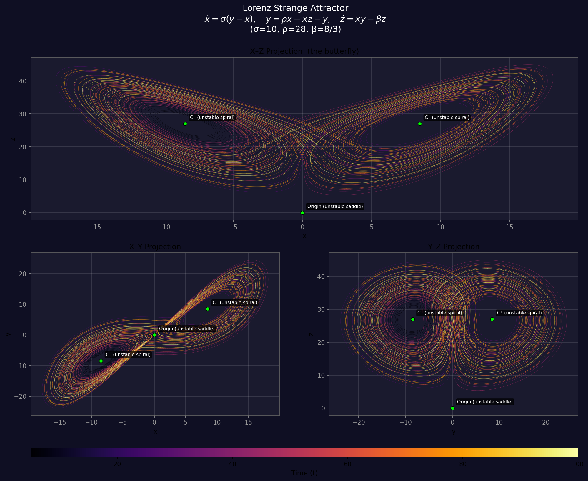

# 2D Phase Portrait Generator for Dynamical Systems

Phase portrait generator for 2D autonomous dynamical systems using SymPy, NumPy, and Matplotlib.

## Features

- Symbolic equilibrium finding via SymPy
- Automatic classification of fixed points (stable/unstable nodes, spirals, saddles, centers) using Jacobian eigenvalues
- Streamplot colored by flow speed with quiver field overlay
- Annotated equilibria with type and eigenvalue labels

## Usage

Edit the system at the bottom of `phase_portrait.py`:

```python
x, y = sp.symbols("x y")
f = x + sp.exp(-y)   # dx/dt
g = -y                # dy/dt
plot_phase_portrait(f, g, x, y, xlim=(-4, 4), ylim=(-4, 4))
```

Run:

```bash
python phase_portrait.py
```

## Example

System: $\dot{x} = x + e^{-y}$, $\dot{y} = -y$



Equilibrium at (-1, 0) — **saddle point** with eigenvalues λ = -1, 1.

## Lotka–Volterra Predator-Prey Example

The classic predator-prey model:

$$\dot{x} = \alpha x - \beta x y, \quad \dot{y} = \delta x y - \gamma y$$

with parameters α=1, β=0.5, δ=0.25, γ=0.5.

```bash
python lotka_volterra.py
```



**Equilibria:**
- **(0, 0)** — saddle point (eigenvalues λ = -0.5, 1). The origin is an unstable fixed point where both species are extinct; any small perturbation drives the system away.
- **(2, 2)** — center (eigenvalues λ = ±0.5i). Purely imaginary eigenvalues produce closed orbits — the populations oscillate periodically with no damping.

**Key features visible in the portrait:**
- **Green dashed line** (prey nullcline, `dx/dt = 0`): the horizontal line `y = α/β = 2`. Above it prey declines; below it prey grows.
- **Magenta dashed line** (predator nullcline, `dy/dt = 0`): the vertical line `x = γ/δ = 2`. Left of it predators decline; right of it predators grow.
- **Gray contours**: level curves of the conserved quantity `H(x,y) = δx − γ ln x + βy − α ln y`, confirming that orbits are closed.
- **Gold trajectories**: sample orbits showing the counter-clockwise cycling — prey peak is followed by predator peak with a phase lag.

## Van der Pol Oscillator Example

A nonlinear oscillator with self-sustaining oscillations:

$$\dot{x} = y, \quad \dot{y} = \mu(1 - x^2)y - x$$

with parameter μ = 1.5.

```bash
python van_der_pol.py
```



**Equilibrium:**
- **(0, 0)** — unstable spiral (eigenvalues λ = 0.75 ± 0.661i). The origin repels all nearby trajectories outward.

**Key features visible in the portrait:**
- **Gold closed curve** (limit cycle): the unique stable periodic orbit. All trajectories — whether starting inside or outside — converge to this cycle. This is the hallmark of the Van der Pol oscillator.
- **Orange trajectory** (from inside): starts near the origin and spirals outward toward the limit cycle.
- **Blue trajectory** (from outside): starts far from the origin and spirals inward toward the limit cycle.
- **Green dashed line** (x-nullcline, `dx/dt = 0`): the line `y = 0`.
- **Magenta dashed curve** (y-nullcline, `dy/dt = 0`): the cubic `y = x / [μ(1 − x²)]`, with vertical asymptotes at x = ±1.

The coexistence of an unstable equilibrium with a stable limit cycle is a classic example of a **Hopf bifurcation** — for μ > 0 the system always settles into sustained oscillations regardless of initial conditions.

### Limit Cycles Under Different μ



The parameter μ controls the strength of nonlinear damping and dramatically shapes the limit cycle:

- **Small μ** (0.2, 0.5): the cycle is nearly circular — the oscillator behaves almost like a simple harmonic oscillator with a gentle amplitude-limiting nonlinearity.
- **Moderate μ** (1.0, 1.5, 2.0): the cycle elongates and develops visible asymmetry as the nonlinear term becomes significant.
- **Large μ** (3.0, 5.0): the cycle becomes a sharp-cornered "relaxation oscillation" — the system spends most of its time slowly drifting along the nullcline branches, punctuated by rapid jumps between them. The velocity spikes grow taller while the displacement amplitude stays near x ≈ ±2.

## Homoclinic Orbit — Nonlinear Spring

A conservative system with a homoclinic connection:

$$\dot{x} = y, \quad \dot{y} = -\frac{k}{m}(1 + x)x$$

with k/m = 1. The system has the conserved energy (Hamiltonian):

$$H(x,y) = \frac{y^2}{2} + \frac{k}{m}\left(\frac{x^2}{2} + \frac{x^3}{3}\right)$$

```bash
python homoclinic.py
```



**Equilibria:**
- **(0, 0)** — center (eigenvalues λ = ±i). Surrounded by a family of closed orbits (periodic oscillations).
- **(-1, 0)** — saddle (eigenvalues λ = ±1). The unstable fixed point from which the homoclinic orbit departs and returns.

**Key features visible in the portrait:**
- **Gold loop** (homoclinic orbit): the level curve `H(x,y) = 1/6`, a single trajectory that leaves the saddle along its unstable manifold, loops around the center, and returns to the saddle along its stable manifold as t → ±∞. It separates qualitatively different types of motion.
- **Gray contours inside the loop**: closed orbits with `H < 1/6` — bounded oscillations around the center.
- **Gray contours outside the loop**: open orbits with `H > 1/6` — trajectories that escape to infinity rather than oscillating.
- **Green dashed line** (x-nullcline): `y = 0`.
- **Magenta dashed lines** (y-nullcline): `x = 0` and `x = -1`, intersecting at the two equilibria.

The homoclinic orbit acts as a **separatrix** — it divides phase space into regions of qualitatively different dynamics (bounded oscillation vs. unbounded motion).

## Logistic Map — Bifurcation & Chaos

A discrete-time system exhibiting the period-doubling route to chaos:

$$x_{n+1} = r\, x_n\,(1 - x_n)$$

```bash
python logistic_map.py
```

### Bifurcation Diagram



As the growth rate parameter r increases, the logistic map undergoes a cascade of **period-doubling bifurcations**:

- **r = 3.0** — the stable fixed point splits into a period-2 cycle
- **r ≈ 3.449** — period-2 → period-4
- **r ≈ 3.544** — period-4 → period-8
- **r ≈ 3.570** — onset of chaos (the accumulation point of infinitely many doublings)
- **r ≈ 3.828** — a period-3 window emerges from within the chaotic regime

The successive bifurcation intervals shrink by **Feigenbaum's constant** δ ≈ 4.669, a universal ratio that appears in any one-dimensional map with a quadratic maximum — not just the logistic map. This universality connects the logistic map to renormalization group ideas in statistical physics.

### Self-Similarity



The bifurcation diagram is a **fractal**: zooming into smaller regions reveals miniature copies of the full diagram. Each panel above zooms into the highlighted rectangle of the previous one:

1. **Full diagram** (r ∈ [2.5, 4.0]) — the complete period-doubling cascade and chaotic regime.
2. **Period-doubling cascade** (r ∈ [3.4, 3.6]) — successive bifurcations converging to the Feigenbaum point.
3. **Period-3 window** (r ∈ [3.82, 3.86]) — a stable period-3 cycle that itself undergoes period-doubling, creating a miniature copy of the full diagram.
4. **Deep zoom** (r ∈ [3.845, 3.857]) — the period-3 window's own cascade, structurally identical to the original.

This self-similarity at every scale is the hallmark of the logistic map's fractal structure and is a direct consequence of Feigenbaum universality.

## Lorenz System — Strange Attractor

A 3D continuous system exhibiting deterministic chaos:

$$\dot{x} = \sigma(y - x), \quad \dot{y} = \rho x - xz - y, \quad \dot{z} = xy - \beta z$$

with classic chaotic parameters σ = 10, ρ = 28, β = 8/3.

```bash
python lorenz.py
```



**Equilibria (all unstable for these parameters):**
- **(0, 0, 0)** — unstable saddle. One positive real eigenvalue drives trajectories away from the origin along the x-axis.
- **C± = (±8.485, ±8.485, 27)** — unstable spirals. Complex eigenvalues with positive real part cause trajectories to spiral outward from each wing's center, sending them back across to the other wing.

**Key features visible in the portrait:**
- **Butterfly shape** (XZ projection): the trajectory winds around C⁺ for a while, then crosses to C⁻ and back — the number of loops on each side is unpredictable. This is the hallmark of the Lorenz attractor.
- **Strange attractor**: despite being deterministic, the trajectory never repeats. It is confined to a fractal set of dimension ≈ 2.06 — more than a surface but less than a volume.
- **Sensitive dependence on initial conditions**: two trajectories starting arbitrarily close will diverge exponentially, making long-term prediction impossible. This is the essence of chaos.
- **Time coloring** (inferno colormap): reveals how the trajectory visits both wings over time, with no discernible periodic pattern.

The three projections (XZ, XY, YZ) show complementary views of the same 3D trajectory, each emphasizing different aspects of the attractor's geometry.

## Dependencies

- sympy
- numpy
- matplotlib
- scipy
