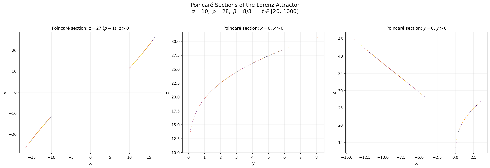
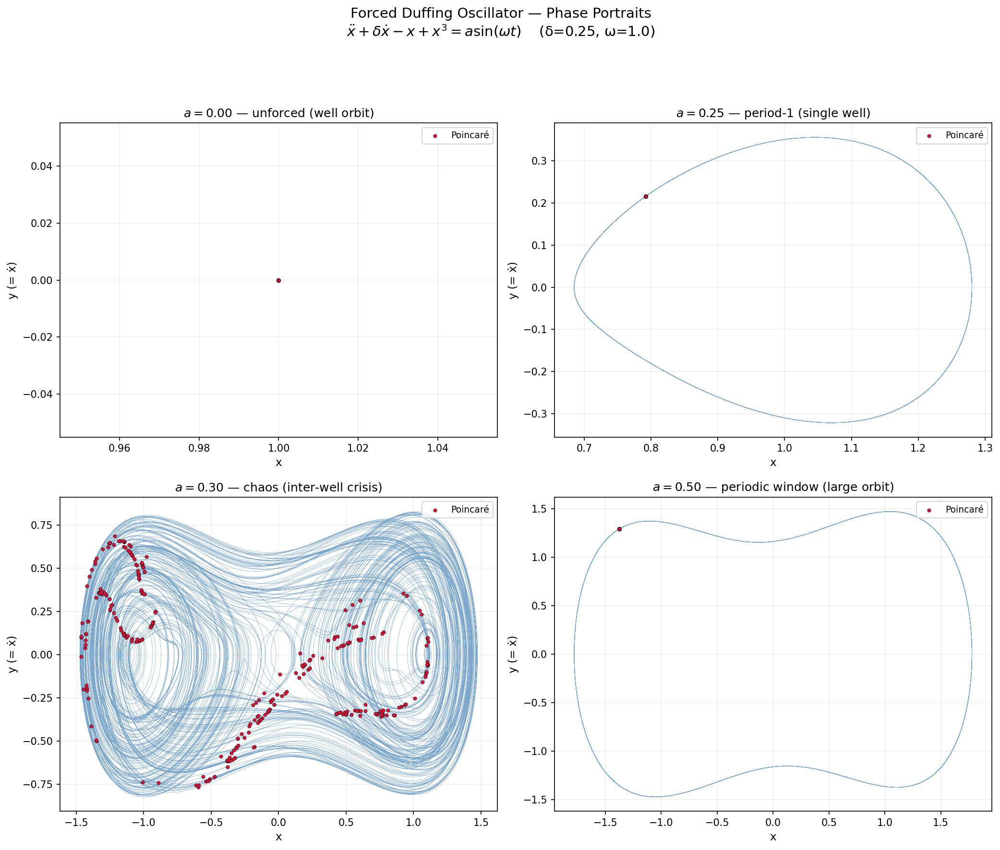
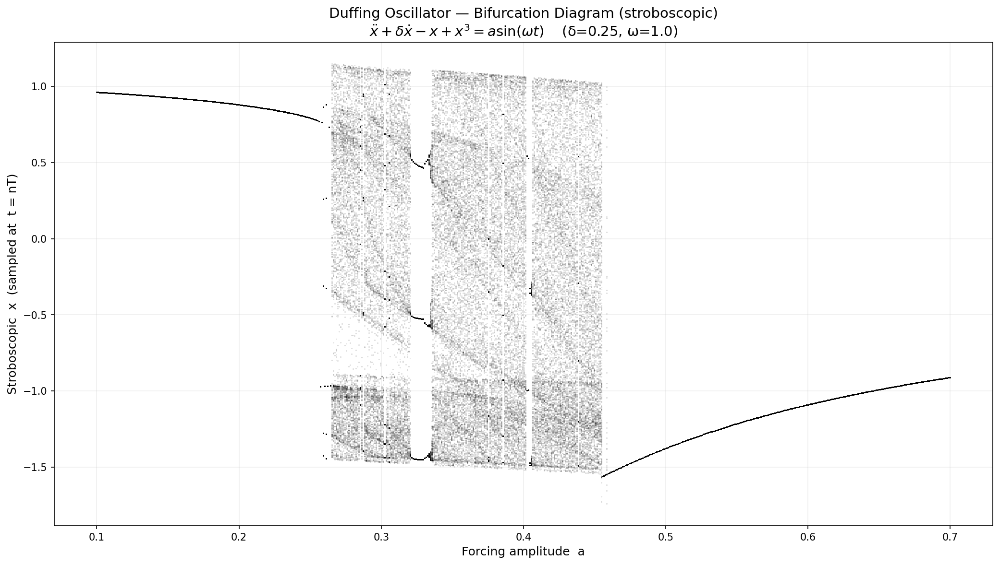
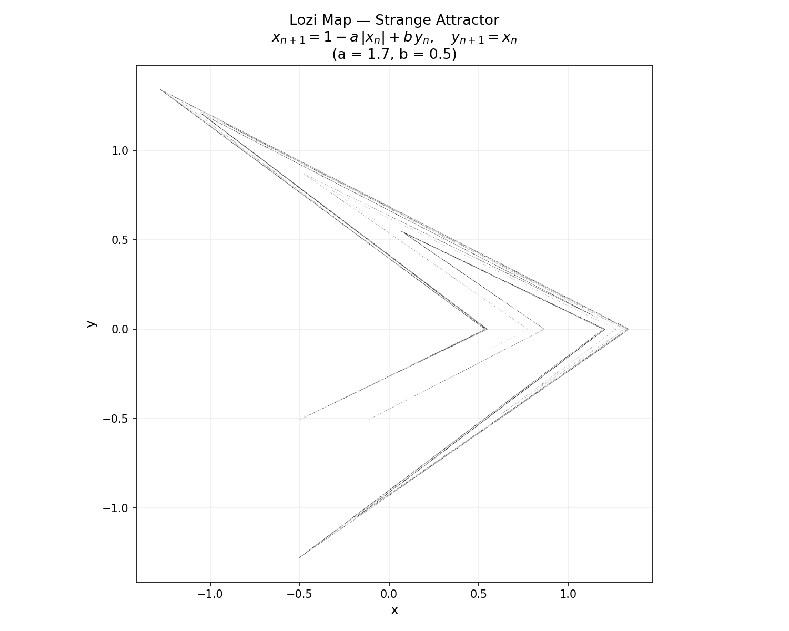
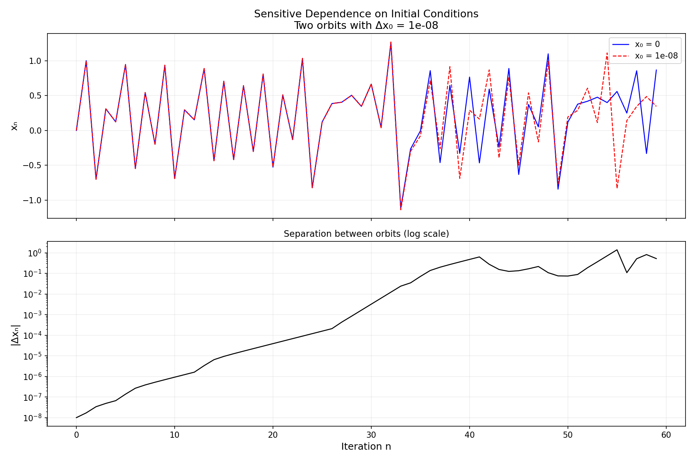
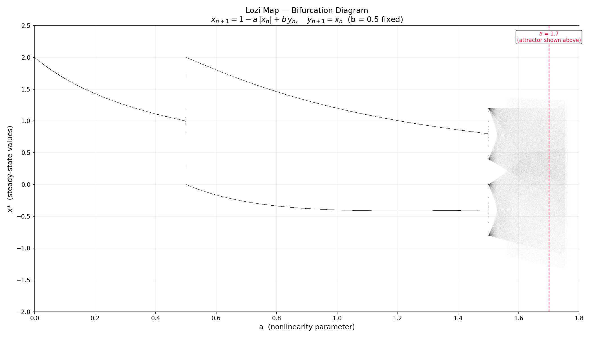
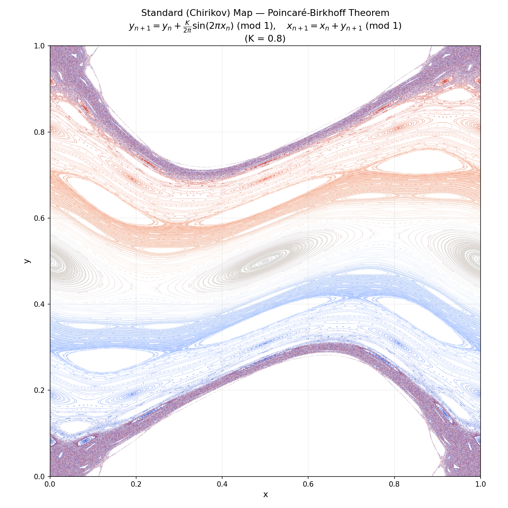

# 2D Phase Portrait Generator for Dynamical Systems

Phase portrait generator for 2D autonomous dynamical systems using SymPy, NumPy, and Matplotlib.

## Features

- Symbolic equilibrium finding via SymPy
- Automatic classification of fixed points (stable/unstable nodes, spirals, saddles, centers) using Jacobian eigenvalues
- Streamplot colored by flow speed with quiver field overlay
- Annotated equilibria with type and eigenvalue labels

## Usage

Edit the system at the bottom of `phase_portrait.py`:

```python
x, y = sp.symbols("x y")
f = x + sp.exp(-y)   # dx/dt
g = -y                # dy/dt
plot_phase_portrait(f, g, x, y, xlim=(-4, 4), ylim=(-4, 4))
```

Run:

```bash
python phase_portrait.py
```

## Example

System: $\dot{x} = x + e^{-y}$, $\dot{y} = -y$


Equilibrium at (-1, 0) — **saddle point** with eigenvalues λ = -1, 1.

## Lotka–Volterra Predator-Prey Example

The classic predator-prey model:

$$\dot{x} = \alpha x - \beta x y, \quad \dot{y} = \delta x y - \gamma y$$

with parameters α=1, β=0.5, δ=0.25, γ=0.5.

```bash
python lotka_volterra.py
```


**Equilibria:**
- **(0, 0)** — saddle point (eigenvalues λ = -0.5, 1). The origin is an unstable fixed point where both species are extinct; any small perturbation drives the system away.
- **(2, 2)** — center (eigenvalues λ = ±0.5i). Purely imaginary eigenvalues produce closed orbits — the populations oscillate periodically with no damping.

**Key features visible in the portrait:**
- **Green dashed line** (prey nullcline, `dx/dt = 0`): the horizontal line `y = α/β = 2`. Above it prey declines; below it prey grows.
- **Magenta dashed line** (predator nullcline, `dy/dt = 0`): the vertical line `x = γ/δ = 2`. Left of it predators decline; right of it predators grow.
- **Gray contours**: level curves of the conserved quantity `H(x,y) = δx − γ ln x + βy − α ln y`, confirming that orbits are closed.
- **Gold trajectories**: sample orbits showing the counter-clockwise cycling — prey peak is followed by predator peak with a phase lag.

## Van der Pol Oscillator Example

A nonlinear oscillator with self-sustaining oscillations:

$$\dot{x} = y, \quad \dot{y} = \mu(1 - x^2)y - x$$

with parameter μ = 1.5.

```bash
python van_der_pol.py
```


**Equilibrium:**
- **(0, 0)** — unstable spiral (eigenvalues λ = 0.75 ± 0.661i). The origin repels all nearby trajectories outward.

**Key features visible in the portrait:**
- **Gold closed curve** (limit cycle): the unique stable periodic orbit. All trajectories — whether starting inside or outside — converge to this cycle. This is the hallmark of the Van der Pol oscillator.
- **Orange trajectory** (from inside): starts near the origin and spirals outward toward the limit cycle.
- **Blue trajectory** (from outside): starts far from the origin and spirals inward toward the limit cycle.
- **Green dashed line** (x-nullcline, `dx/dt = 0`): the line `y = 0`.
- **Magenta dashed curve** (y-nullcline, `dy/dt = 0`): the cubic `y = x / [μ(1 − x²)]`, with vertical asymptotes at x = ±1.

The coexistence of an unstable equilibrium with a stable limit cycle is a classic example of a **Hopf bifurcation** — for μ > 0 the system always settles into sustained oscillations regardless of initial conditions.

### Limit Cycles Under Different μ


The parameter μ controls the strength of nonlinear damping and dramatically shapes the limit cycle:

- **Small μ** (0.2, 0.5): the cycle is nearly circular — the oscillator behaves almost like a simple harmonic oscillator with a gentle amplitude-limiting nonlinearity.
- **Moderate μ** (1.0, 1.5, 2.0): the cycle elongates and develops visible asymmetry as the nonlinear term becomes significant.
- **Large μ** (3.0, 5.0): the cycle becomes a sharp-cornered "relaxation oscillation" — the system spends most of its time slowly drifting along the nullcline branches, punctuated by rapid jumps between them. The velocity spikes grow taller while the displacement amplitude stays near x ≈ ±2.

## Homoclinic Orbit — Nonlinear Spring

A conservative system with a homoclinic connection:

$$\dot{x} = y, \quad \dot{y} = -\frac{k}{m}(1 + x)x$$

with k/m = 1. The system has the conserved energy (Hamiltonian):

$$H(x,y) = \frac{y^2}{2} + \frac{k}{m}\left(\frac{x^2}{2} + \frac{x^3}{3}\right)$$

```bash
python homoclinic.py
```


**Equilibria:**
- **(0, 0)** — center (eigenvalues λ = ±i). Surrounded by a family of closed orbits (periodic oscillations).
- **(-1, 0)** — saddle (eigenvalues λ = ±1). The unstable fixed point from which the homoclinic orbit departs and returns.

**Key features visible in the portrait:**
- **Gold loop** (homoclinic orbit): the level curve `H(x,y) = 1/6`, a single trajectory that leaves the saddle along its unstable manifold, loops around the center, and returns to the saddle along its stable manifold as t → ±∞. It separates qualitatively different types of motion.
- **Gray contours inside the loop**: closed orbits with `H < 1/6` — bounded oscillations around the center.
- **Gray contours outside the loop**: open orbits with `H > 1/6` — trajectories that escape to infinity rather than oscillating.
- **Green dashed line** (x-nullcline): `y = 0`.
- **Magenta dashed lines** (y-nullcline): `x = 0` and `x = -1`, intersecting at the two equilibria.

The homoclinic orbit acts as a **separatrix** — it divides phase space into regions of qualitatively different dynamics (bounded oscillation vs. unbounded motion).

## Logistic Map — Bifurcation & Chaos

A discrete-time system exhibiting the period-doubling route to chaos:

$$x_{n+1} = r\, x_n\,(1 - x_n)$$

```bash
python logistic_map.py
```

### Bifurcation Diagram


As the growth rate parameter r increases, the logistic map undergoes a cascade of **period-doubling bifurcations**:

- **r = 3.0** — the stable fixed point splits into a period-2 cycle
- **r ≈ 3.449** — period-2 → period-4
- **r ≈ 3.544** — period-4 → period-8
- **r ≈ 3.570** — onset of chaos (the accumulation point of infinitely many doublings)
- **r ≈ 3.828** — a period-3 window emerges from within the chaotic regime

The successive bifurcation intervals shrink by **Feigenbaum's constant** δ ≈ 4.669, a universal ratio that appears in any one-dimensional map with a quadratic maximum — not just the logistic map. This universality connects the logistic map to renormalization group ideas in statistical physics.

### Self-Similarity


The bifurcation diagram is a **fractal**: zooming into smaller regions reveals miniature copies of the full diagram. Each panel above zooms into the highlighted rectangle of the previous one:

1. **Full diagram** (r ∈ [2.5, 4.0]) — the complete period-doubling cascade and chaotic regime.
2. **Period-doubling cascade** (r ∈ [3.4, 3.6]) — successive bifurcations converging to the Feigenbaum point.
3. **Period-3 window** (r ∈ [3.82, 3.86]) — a stable period-3 cycle that itself undergoes period-doubling, creating a miniature copy of the full diagram.
4. **Deep zoom** (r ∈ [3.845, 3.857]) — the period-3 window's own cascade, structurally identical to the original.

This self-similarity at every scale is the hallmark of the logistic map's fractal structure and is a direct consequence of Feigenbaum universality.

## Lorenz System — Strange Attractor

A 3D continuous system exhibiting deterministic chaos:

$$\dot{x} = \sigma(y - x), \quad \dot{y} = \rho x - xz - y, \quad \dot{z} = xy - \beta z$$

with classic chaotic parameters σ = 10, ρ = 28, β = 8/3.

```bash
python lorenz.py
```


**Equilibria (all unstable for these parameters):**
- **(0, 0, 0)** — unstable saddle. One positive real eigenvalue drives trajectories away from the origin along the x-axis.
- **C± = (±8.485, ±8.485, 27)** — unstable spirals. Complex eigenvalues with positive real part cause trajectories to spiral outward from each wing's center, sending them back across to the other wing.

**Key features visible in the portrait:**
- **Butterfly shape** (XZ projection): the trajectory winds around C⁺ for a while, then crosses to C⁻ and back — the number of loops on each side is unpredictable. This is the hallmark of the Lorenz attractor.
- **Strange attractor**: despite being deterministic, the trajectory never repeats. It is confined to a fractal set of dimension ≈ 2.06 — more than a surface but less than a volume.
- **Sensitive dependence on initial conditions**: two trajectories starting arbitrarily close will diverge exponentially, making long-term prediction impossible. This is the essence of chaos.
- **Time coloring** (inferno colormap): reveals how the trajectory visits both wings over time, with no discernible periodic pattern.

The three projections (XZ, XY, YZ) show complementary views of the same 3D trajectory, each emphasizing different aspects of the attractor's geometry.

### Poincaré Sections

A Poincaré section records where the trajectory pierces a chosen plane, collapsing the continuous 3D flow into a discrete 2D map. This reveals the fractal microstructure hidden within the strange attractor.

```bash
python lorenz_poincare.py
```



Three sections through the attractor (long integration, t ∈ [20, 1000]):

1. **z = 27 (= ρ−1), upward crossings** → plot (x, y). This plane passes through the two unstable equilibria C±. The section shows two thin curved bands — one for each wing of the attractor.
2. **x = 0, rightward crossings** → plot (y, z). The symmetry plane of the Lorenz system. The curved band traces the trajectory's transition between the two lobes.
3. **y = 0, crossings with ẏ > 0** → plot (x, z). Shows the attractor sliced through a different symmetry, revealing a complementary band structure.

**Key features:**
- **Fractal banding**: each apparent "line" is actually composed of infinitely many sub-bands at finer scales — a Cantor-like structure with non-integer dimension. This is the geometric signature of the strange attractor.
- **Deterministic structure**: despite the chaotic dynamics, the crossings are confined to thin, well-defined curves rather than filling a 2D region. The attractor has dimension ≈ 2.06, so its Poincaré sections are nearly one-dimensional.
- **No periodicity**: points never exactly repeat, confirming the aperiodic nature of the Lorenz system.

## Forced Duffing Oscillator — Route to Chaos

A nonlinear oscillator driven by a periodic force, exhibiting a transition from regular to chaotic motion:

$$\ddot{x} + \delta\dot{x} - x + x^3 = a\sin(\omega t)$$

with δ = 0.25 (damping) and ω = 1.0 (driving frequency). The double-well potential $V(x) = -x^2/2 + x^4/4$ has minima at $x = \pm 1$.

```bash
python duffing.py
```

### Phase Portraits



Four forcing amplitudes reveal the route to chaos:

- **a = 0.00** — unforced: the trajectory sits near the equilibrium at x = 1 (right well). Without forcing, the damped system simply decays to the bottom of whichever well it starts in.
- **a = 0.25** — period-1: forcing drives a single closed orbit confined to the right well. The stroboscopic Poincaré section (red dots, sampled once per driving period) collapses to a single point — the hallmark of a periodic response.
- **a = 0.30** — chaos: the orbit has escaped its home well via a **boundary crisis** and wanders unpredictably between both wells. The Poincaré section scatters across a complex region — no two driving cycles produce the same state.
- **a = 0.50** — periodic window: order re-emerges. The system settles into a large-amplitude period-1 orbit that encircles both wells. Periodic windows embedded within the chaotic regime are a universal feature of nonlinear systems.

### Bifurcation Diagram



The stroboscopic bifurcation diagram sweeps forcing amplitude a ∈ [0.1, 0.7]:

- **a < 0.26** — a single line: the system responds periodically (period-1) within one potential well.
- **a ≈ 0.26** — **boundary crisis**: the orbit abruptly escapes its well. The stroboscopic points explode from a single line into a broad chaotic band spanning both wells (x ≈ −1.5 to +1.1).
- **a ≈ 0.26–0.45** — chaotic regime with visible **periodic windows** (narrow vertical gaps where the system briefly returns to periodic behavior).
- **a > 0.45** — the system re-stabilizes into a large-amplitude periodic orbit around both wells.

Unlike the logistic map's gradual period-doubling cascade, the Duffing oscillator's route to chaos here is a **crisis bifurcation** — an abrupt, discontinuous transition triggered when the periodic orbit collides with the boundary of its basin of attraction.

## Lozi Map — Orbit Structure and Chaos

A piecewise-linear 2D discrete map that produces a strange attractor:

$$x_{n+1} = 1 - a\,|x_n| + b\,y_n, \quad y_{n+1} = x_n$$

with classic chaotic parameters a = 1.7, b = 0.5. The absolute value makes the map piecewise-linear, producing sharp folds instead of the smooth curves seen in the Hénon map.

```bash
python lozi_map_chaos.py
```

### Strange Attractor



The attractor has a characteristic angular, tent-like shape with visible fractal banding — each apparent line resolves into parallel sub-bands at finer scales. Unlike the Hénon attractor's smooth parabolic folds, the Lozi attractor's structure is built entirely from straight-line segments meeting at sharp corners, a direct consequence of the |x| nonlinearity.

### Sensitive Dependence on Initial Conditions



Two orbits starting at x₀ = 0 and x₀ = 10⁻⁸ (a perturbation smaller than the diameter of an atom):

- **Top panel**: both x-trajectories track identically for ~30 iterations, then diverge completely — the trajectories become uncorrelated.
- **Bottom panel**: the separation |Δxₙ| grows exponentially (roughly linear on the log scale), confirming a positive Lyapunov exponent — the defining signature of chaos.

### Bifurcation Diagram



Sweeping the nonlinearity parameter a with b = 0.5 fixed:

- **a < 0.5** — a single stable fixed point.
- **a = 0.5** — period-doubling bifurcation to a 2-cycle.
- **a ≈ 0.5–1.5** — stable period-2 orbit (two branches visible).
- **a ≈ 1.5** — onset of further bifurcations. Unlike the logistic map's smooth period-doubling cascade, the Lozi map transitions to chaos through **border-collision bifurcations** — abrupt, discontinuous changes caused by the orbit hitting the non-smooth boundary at x = 0.
- **a = 1.7** — full chaos (marked with dashed line). The attractor shown above lives here.

## Standard Map — Poincaré-Birkhoff Theorem

The standard (Chirikov) map is an area-preserving twist map on the torus:

$$y_{n+1} = y_n + \frac{K}{2\pi}\sin(2\pi x_n) \pmod{1}, \quad x_{n+1} = x_n + y_{n+1} \pmod{1}$$

At K = 0 the map is integrable — every orbit lies on a horizontal line y = const. As K increases, the **Poincaré-Birkhoff theorem** predicts that rational tori (those with rational winding number p/q) break up, leaving behind exactly 2q fixed points of the q-th iterate, alternating between elliptic (stable) and hyperbolic (unstable). Irrational tori persist as **KAM curves** until K is large enough to destroy them.

```bash
python standard_map.py
```



At K = 0.8, three types of structure coexist:

- **KAM tori** (smooth colored curves): surviving irrational tori that thread continuously across the plot. These act as barriers — chaotic orbits cannot cross them.
- **Island chains**: the destroyed rational tori predicted by Poincaré-Birkhoff. The large elliptical islands near y ≈ 0.5 are the period-1 resonance (winding number 1/2); smaller chains near y ≈ 1/3 and y ≈ 2/3 correspond to higher-order resonances. Each island contains its own nested KAM curves and sub-islands — the structure is self-similar.
- **Chaotic sea**: the scattered, mottled regions surrounding the hyperbolic fixed points. Orbits in the chaotic sea wander ergodically but are confined between surviving KAM tori.

This is the hallmark of **Hamiltonian chaos**: unlike dissipative systems (Lorenz, Duffing) where chaos fills a strange attractor, conservative systems partition phase space into an intricate mixture of regular islands and chaotic seas — the **KAM picture**.

## Kicked Rotator — Resonance Overlap and the Onset of Chaos

The kicked rotator is a free rotor receiving periodic impulses:

$$H = \frac{p^2}{2} + K\cos(\theta)\sum_n \delta(t - n)$$

Its stroboscopic Poincaré section (sampled once per kick period) is exactly the standard map. The kick strength K controls how strongly the rotor is perturbed each period.

```bash
python kicked_rotator.py
```


Six panels show the phase portrait as K increases from integrable to fully chaotic:

- **K = 0** (integrable): all orbits lie on horizontal lines p = const — the rotor spins freely at constant angular momentum.
- **K = 0.5**: primary resonance islands appear (visible near p ≈ 0 and p ≈ 0.5), but all KAM tori survive as continuous curves separating them. Chaotic motion is impossible — orbits are trapped between barriers.
- **K = 0.8**: islands have grown, thin chaotic layers surround the hyperbolic points, but KAM tori still confine the chaos.
- **K = 0.9716** (critical, K_c): the **last KAM torus breaks**. This is the **Chirikov resonance overlap criterion** — neighboring resonance islands have grown large enough to touch, and the chaotic layers merge into a connected sea. For the first time, an orbit can diffuse across the entire phase space.
- **K = 1.5**: a large chaotic sea dominates, with surviving islands visible as white voids. The remaining KAM curves are few and far between.
- **K = 3.0**: nearly global chaos. Only tiny island remnants survive — the system is almost fully ergodic.

The critical value K_c ≈ 0.9716 is a fundamental threshold in Hamiltonian dynamics: below it, phase space is divided into disconnected regions by KAM barriers; above it, global transport (diffusion in momentum) becomes possible. This transition from confined to unbounded chaos is the **resonance overlap mechanism** — the primary route to chaos in Hamiltonian systems.

## Dependencies

- sympy
- numpy
- matplotlib
- scipy
